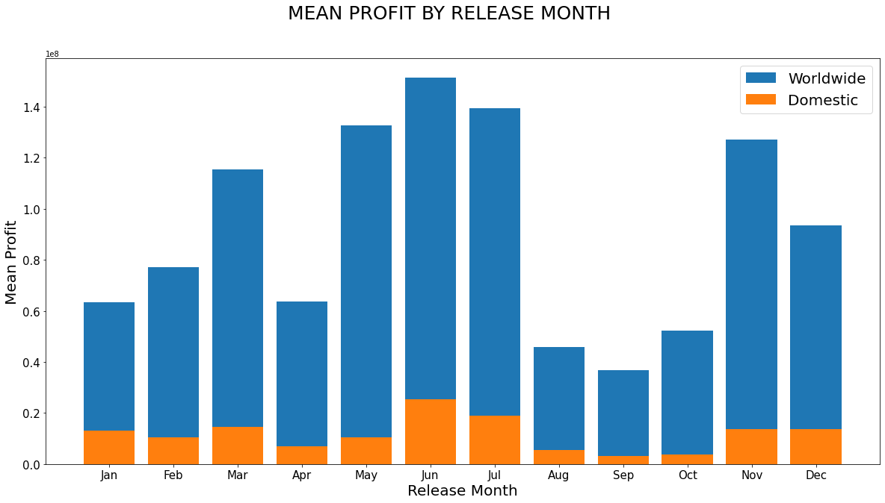
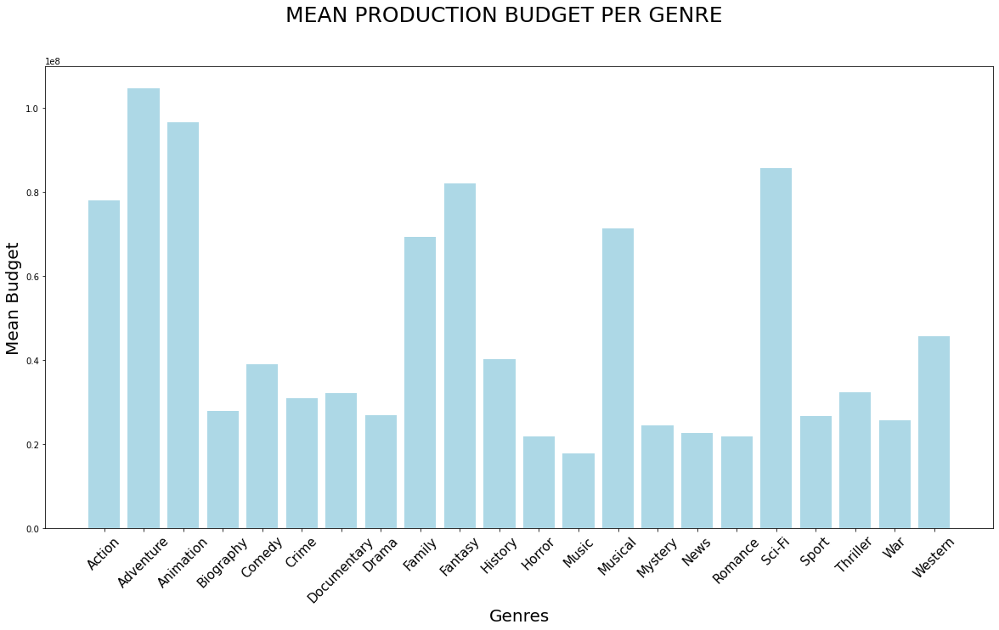
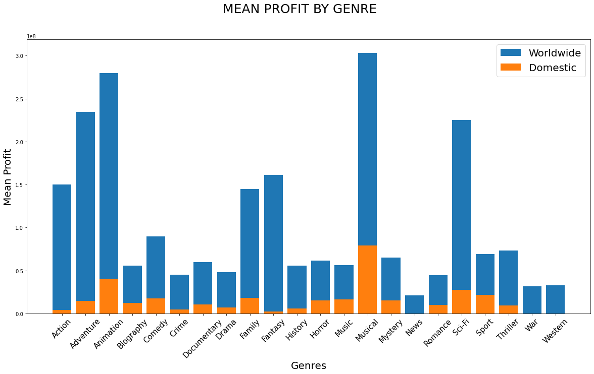
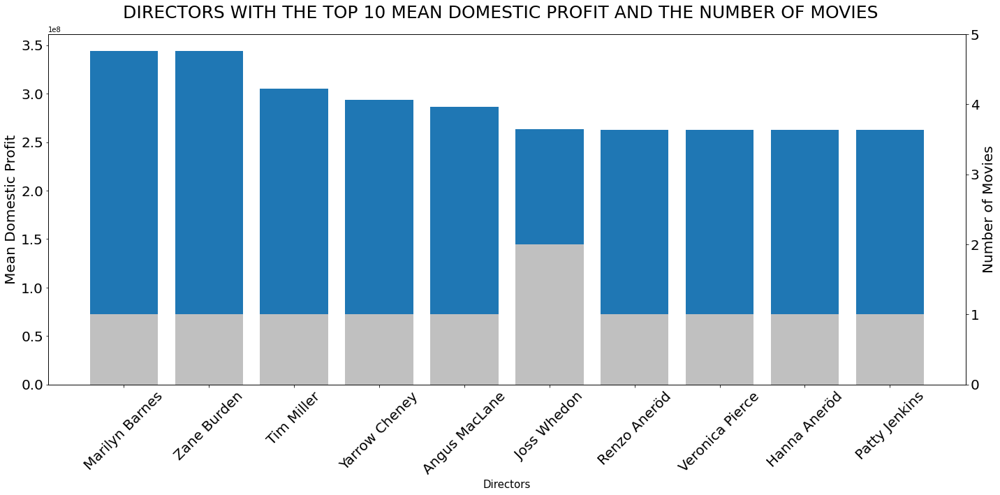
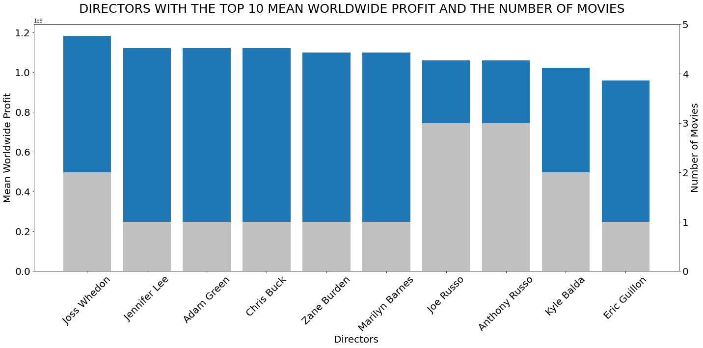

# Movies: A Data Analysis

## A Phase 1 Project

**Authors**: Wonuola Abimbola, Edgar Gonzalez

### Overview

Our research seeks to analyze data on the movie industry, to glean any insights, and make recommendations to make Microsoft Studios: Film Division as profitable as possible.

### Business Problem

Microsoft wants to open a film division of Microsoft Studios but lacks any knowledge in creating profitable movies. 

### Our Data 

Original datasets used can be found in the folder `zippedData` which were provided by The Flatiron School.
Images and images of plots used in this README.md are in the folder `images`, and data used for analysis can be found in 'Data" Folder.

### Methods

We posed 3 questions to ourselves:

 - Does release date have an effect on movie profits?
 - Do certain genres tend to be more successful than others?
 - Do certain directors have an effect on the profitabilty of movies?

We only considered movies released in 2010 and onward, as we felt these were the most relevant to current trends. We also did not consider movies without domestic or worldwide gross. We assessed how profitiable movies were based on the difference between domestic gross and production budget as our domestic profit, and worldwide gross and production budget as our worlwide profit. Next we seperated our data by genre, release month, and director.

### Results
#### Movies tend to do better when released at certain times of the year

We can see from the graph above that profit for domestic movie releases only peak in June and July. 
Looking at worldwide release profit we see that the profit peak extends to May with 2 lesser peaks in March and Novemeber. Profits are at the lowest, both for domestic and worlwide, between August and October.

#### Certain genres of movies tend to me much more profitable

The graphs above show us large profit gains from musicals, adventure, sci-fi, and animation even though they have the highest production budgets. The smallest profits came from westerns, war and news movies, even with an average production budget, with westerns performing the worst.

#### Few directors seem consistently successful on both domestic and worldwide markets

We can see that there are only 2 directors that were very successful in both markets, Joss Whedon and Zane Burden

### Conclusion

Based on our findings, we believe Microsoft Studios would find the most success hiring directors such as Joss Whedon and Zane Burden, who have made movies that were both profitable and had both domestic and worldwide appeal. 
Movies that are produced should be musicals, animated or sci-fi. Though the production budget for these genres can be high, the profit is significantly higher. 
Our last recommendation is that movies should be released in May, June, or July. If that 3 month window is missed then November would be the only other recommended time.

### Summary

 - Hire directors who have proven worldwide appeal (E.g. Joss Whedon, Zane Burden)
 - Create musicals, animated films, or sci-fi movies
 - Ideally release movies between May - July

### Recommendations for Further Research

We do want to make a note that during our analysis we left many avenues of research unexplored due to lack of data or being out of scope of this project and we highly recommend another study into those avenues

 - Since the pandemic started it would be wise to do another study of profitability into streaming services. Since movies released on streaming services do not have a traditional measure for gross profit, they could not be included in this project but their impact on the future should not be ignored.

 - The role advertisement plays in monetary success of a movie should be explored and considered

## Navigation:

-data_analysis.ipynb: Final notebook containing our finished work and discussions (/Data)

-data_cleaning.ipynb: Notebooks containing the authors preliminary EDA and data cleaning (/Data)

-data_exploration: Notebooks containing the exploration of the data in zippedData file (/Data)

-clean_data.csv: File containing our cleaned data sets (/Data)

-aggregate.db: database used in storing and retrieving our data  (/Data)

-zippedData: Original data obtained from the Flatiron School

-README.md: Synopsis containing our key findings

-Images: Folder containing images used in this project

-analysis_of_film_industry_.pdf: The final presentation

